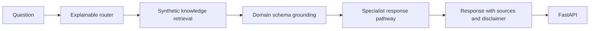

<div align="center">

# Life Sciences Multi-Agent AI Chatbot

### Domain routing • Retrieval grounding • Structured schemas • FastAPI

**Developed by Meghana Pentyala**

[](https://python.org)
[](https://developers.openai.com/api/docs)
[](https://fastapi.tiangolo.com)
[](https://github.com/pentyala123/life-sciences-multi-agent-chatbot/actions/workflows/ci.yml)

</div>

## Overview

This public portfolio project demonstrates a multi-agent routing architecture for life-sciences questions. It classifies each query, retrieves relevant synthetic reference material, applies a domain-specific structured schema, and delegates response generation to the appropriate specialist pathway.

The application runs without an API key using a deterministic local response generator. When `OPENAI_API_KEY` is configured, it uses the OpenAI Responses API. The default API model can be changed through `OPENAI_MODEL`.

> Educational demonstration only. It is not medical, clinical, legal, safety, or regulatory advice. All responses require verification against authoritative sources and qualified professionals.

## Specialist routes

| Route | Scope |
|---|---|
| `clinical_trials` | Trial phases, eligibility, study status, sponsors, and endpoints |
| `drug_interactions` | Interactions, contraindications, pharmacokinetics, and adverse effects |
| `regulatory` | FDA/EMA guidance, submissions, and ICH-aligned compliance |
| `pharmacovigilance` | Adverse-event reporting, signals, and post-market surveillance |
| `general` | Other life-sciences questions |

## Architecture



## Quick start

```bash
git clone https://github.com/pentyala123/life-sciences-multi-agent-chatbot.git
cd life-sciences-multi-agent-chatbot
python3 -m venv .venv
source .venv/bin/activate
python -m pip install -e ".[api]"
```

Run the API:

```bash
python app.py
```

Open `http://localhost:8000/docs`.

## API example

```bash
curl -X POST http://localhost:8000/chat \
  -H "Content-Type: application/json" \
  -d '{"query":"What information is typically tracked for a Phase 3 trial?"}'
```

## Optional OpenAI configuration

The local fallback is used by default. To enable generated responses, create a local `.env` from `.env.example` and provide your own authorized key:

```bash
export OPENAI_API_KEY="your-key"
export OPENAI_MODEL="gpt-5.6-luna"
python app.py
```

Never place the key directly in Python code or commit `.env`. The implementation uses the Responses API through the official Python SDK.

## Tests

```bash
PYTHONPATH=src python -m unittest discover -s tests -v
```

## Docker

```bash
docker compose up --build
```

## Repository structure

```text
├── .github/workflows/ci.yml
├── data/synthetic/knowledge.json
├── docs/architecture.md
├── src/life_sciences_chatbot/
│   ├── api.py
│   ├── llm.py
│   ├── models.py
│   ├── retrieval.py
│   ├── routing.py
│   ├── schemas.py
│   └── service.py
├── tests/
├── app.py
├── Dockerfile
├── docker-compose.yml
└── pyproject.toml
```

## Public repository boundary

- Synthetic reference content only
- No patient records, clinical documents, client data, credentials, or internal databases
- No diagnosis, prescribing, safety decisions, or regulatory decisions
- No invented citations: responses are instructed to use retrieved context only
- Production deployment requires authorized sources, authentication, audit logs, evaluation, security review, monitoring, and qualified human oversight

## Author

**Meghana Pentyala**  
Generative AI Engineer | AI/ML | Agentic AI | AWS & Azure

- GitHub: [pentyala123](https://github.com/pentyala123)
- LinkedIn: [Meghana Pentyala](https://www.linkedin.com/in/meghana-pentyala-00a146198)
- Portfolio: [pentyala123.github.io/MeghanaPentyala](https://pentyala123.github.io/MeghanaPentyala/)

## License

[MIT](LICENSE)
