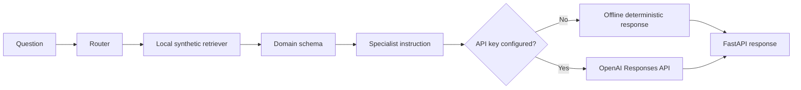

# Architecture

The public implementation separates routing, retrieval, schema context, response generation, and delivery so each component can be evaluated independently.

## Production evolution

Replace the synthetic retriever with an authorized vector store, add document provenance and freshness checks, protect the API with authentication and rate limits, keep secrets in a managed vault, evaluate routing and groundedness, detect prompt injection, log safely, monitor cost and latency, and require qualified human review.
